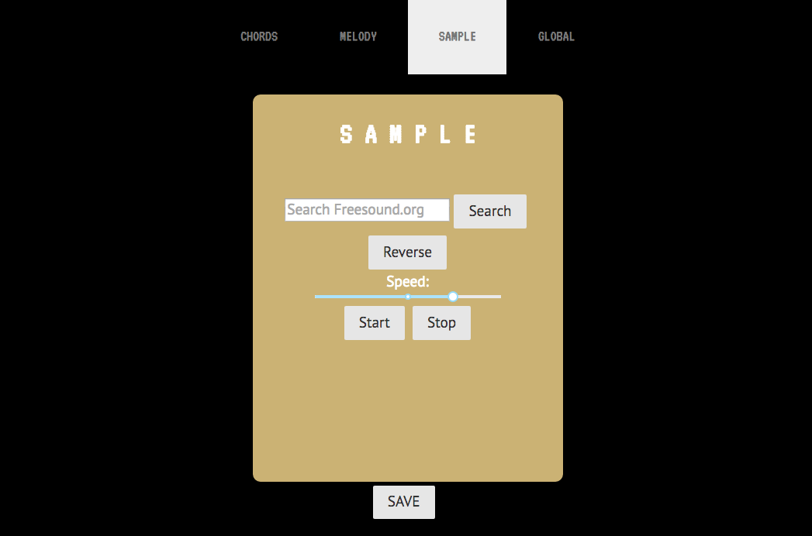

# Generative Music App
# 

### Technologies Used 

* MERN Stack
    * MongoDB
    * Express.js
    * React.js
    * Node.js

* Tone.js - Web Audio API framework

* Fetch requests to freesound.org API

### Approach

**Each page in the navbar represents a different instrument, except "Global" which allows global control over all instruments.  In "chords", 7 chords are played back randomly at random intervals.  Similarly, "melody" plays 7 random notes that are in the same key signature, so the harmonies should always be relatively consonant.  "Sample" allows you to search the freesound.org api and load a sound into a granular sampler.**  

**The settings for each instrument are stored in the state for the main parent app.js.  Methods which update the state are then passed down to individual instrument components to allow real time control over the sounds.  When the user clicks "save," the instrument states are pushed to MongoDB where the entire composition is stored in a "song" model.  Users login through Google oAuth so each user can create their own unique composition.**  

### Dependency Installation 

* npm install

### Major Hurdles

**My main issues were organizational, e.g. determing the best components to store state and methods in order to update the DOM, perform crud operations and update the instrument settings.**

### Routes

* GET '/songs' - load song settings for current user
* POST '/songs' - save current song 
* PUT '/songs' - update current song

